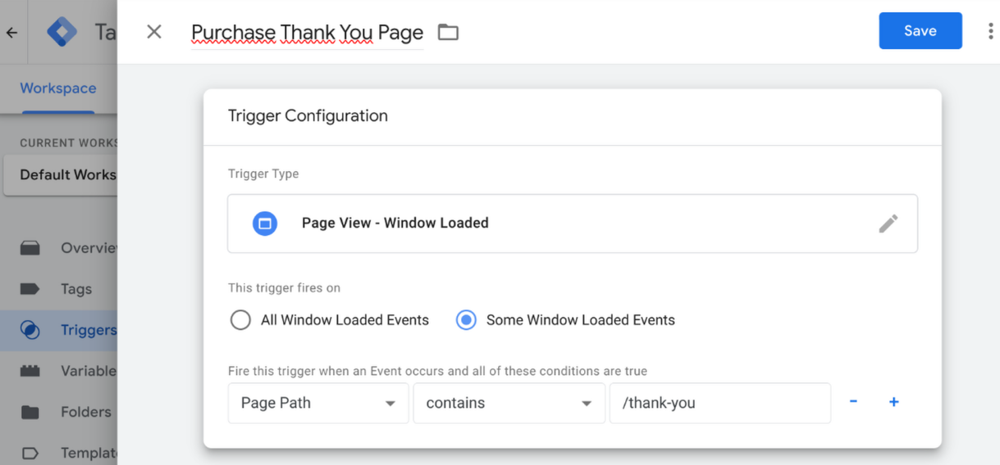
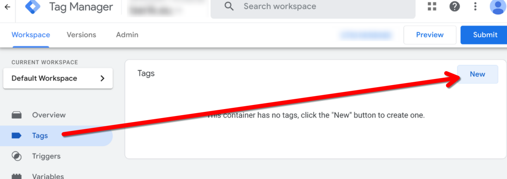

# Shoparize Tracking - GTM Template

## Table of Contents

- [What is it for? - General Information](#what-is-it-for----general-information)
- [Usage](#usage)
- [Contact and more Information](#contact-and-more-information)
- [Changelog](#changelog)

---

## What is it for? - General Information

This is a Google Tag Manager Template to use the Shoparize (Tracking) API.
**Please note:** This template is not officially provided or approved by Shoparize. It is a custom, unofficial template created by me because there is no official template (yet).

---

## Usage

Go through the following steps to use the Template:

### (1) Import the Template

Download the file "template.tpl" and navigate to your GTM Container.

Click on templates and the "New" Button:

Click the 3-Point-Menu in the upper right corner and select "Import":

Save the imported Template:

### (2) Create the Trigger

We need two Trigger:
1. One Trigger for all Pages except the Order Thank You Page.
2. One Trigger for (only) the Order Thank You Page.
*If possible, configure the Trigger on "Window Loaded", so that they trigger after the page is loaded.*

Navigate to the GTM Trigger.

Create the Pageview Trigger for all Pages excepting the Order Thank You Page:

Create the Pageview Trigger for the Order Thank You Page:

### (3) Configure the Shoparize Pageview

Navigate to the GTM Tags and click the "New" Button:

Click in the Tag Configuration and select the Shoparize Tag:

Configure the Shoparize Pageview Tag:

1. Enter a meaningful name for the Tag, e.g. "Shoparize Pageview"
2. Enter your Shoparize Partner Shop ID, e.g. "1234"
3. Select the Trigger you created in Step (2)

### (4) Configure the Shoparize Purchase

Stay by GTM Tags and click again the "New" Button:

Configure the Shoparize Pageview Tag:

1. Enter a meaningful name for the Tag, e.g. "Shoparize Purchase"
2. Enter your Shoparize Partner Shop ID, e.g. "1234"
3. Select "Purchase Page" for the Page Type Field
4. Configure the ECommerce Settings. If you don't know what to do here, try the "Default DataLayer" option
5. Select the Trigger you created in Step (2)

### Review, test and Publish

Check your settings and test it using the Preview Option of the GTM.

Publish the container version ...

---

## Contact and more Information

Feel free to use or change the code. If you have suggestions for improvement, please write to me.

- **Licence:** Apache 2.0
- **Repository:** [Shoparize Tracking - Github Repository](https://github.com/Andiministrator/Shoparize)

### Author and Contact

Please contact me if you found problems or have improvements:

**Andi Petzoldt**

- ☛ https://andiministrator.de
- ✉ andi@petzoldt.net
- 🧳 https://www.linkedin.com/in/andiministrator/
- 🐘 https://mastodon.social/@andiministrator
- 👥 https://friendica.opensocial.space/profile/andiministrator
- 📷 https://pixelfed.de/Andiministrator
- 🎧 https://open.audio/@Andiministrator/

---

## Changelog

- Version 1.2, *17.11.2025*
  - Inject Script Pattern optimized

- Version 1.1, *13.03.2025*
  - Code revision

- Version 1.0.1, *20.01.2025*
  - GTM Template marked as unofficial

- Version 1.0, *15.01.2025*
  - Initial Version of aGTM

---
